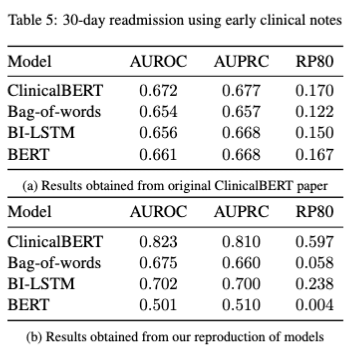
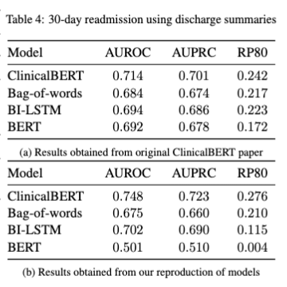
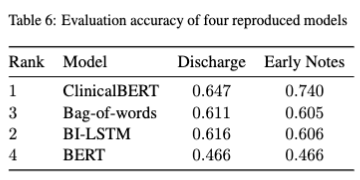

# clinicalBERT
Reproducing, Validating, and Enhancing ClinicalBERT (Madhu Sivaraj and Anish Saha)

#### Summary
Clinical notes are often underutilized in the medical domain, given its high dimensionality, scarcity, and lack of structure. Unlike its structured, quantitative counterparts such as lab results, procedural codes, and medication history, clinical notes - with the help of deep learning models - have the potential to reveal high-quality, physician-assessed semantic relationships between medical concepts, which would otherwise involve a human perspective. Huang et al. (2020) devised ClinicalBERT, a flexible framework for learning deep representations of clinical notes, which can be useful for domain-specific predictive tasks \cite{cbert}. Pre-trained on unstructured clinical text from MIMIC-III, ClinicalBERT leverages two unsupervised tasks, masked language modeling and next sentence prediction, followed by a problem-specific fine-tuning phase.

The goal of this project is to reproduce, validate, and enhance the results postulated by Huang et al. (2020) for ClinicalBERT, a model fine-tuned on a hospital readmission prediction task. We will attempt to improve performance via the ablations of data augmentation and a migration from the pytorch pretrained BERT pipeline to a custom transformers implementation, while also proving the claim that ClinicalBERT outperforms competitive baseline models (Bag-of-Words, Bi-LSTM, and BERT) using the following performance metrics:  area under the receiver operating characteristic curve (AUROC), area under the precision-recall curve (AUPRC), and recall at precision of 80\% (RP80).

To preprocess the data and generate all necessary datasets (original and augmented) used for this project, run the following notebooks: ```./Preprocess.ipynb``` and ```./ablations/Data_Augmentation.ipynb```, ensuring that MIMICIII's directory ```./physionet/``` is in the same relative path as this README. To reproduce baseline results, simply run the two notebooks in the ```./baselines/``` directory. For validating BERT results, use the model in the ```./model/pretraining/``` directory. Finally, to reproduce ClinicalBERT results for all of the different cases we experimented on, simply run the commands below:

```
python3 ./run_readmission.py --task_name readmission --readmission_mode early --do_eval --data_dir ./data/3days/ --bert_model ./model/early_readmission --max_seq_length 512 --output_dir ./results/clinicalbert/1/result_early # task: readmission prediction using early (<3 days) clinical notes data

python3 ./run_readmission.py --task_name readmission --readmission_mode discharge --do_eval --data_dir ./data/discharge/ --bert_model ./model/discharge_readmission --max_seq_length 512 --output_dir ./results/clinicalbert/1/result_discharge # task: readmission prediction using discharge summary clinical notes data

python3 ./run_readmission.py --task_name readmission --readmission_mode early --do_eval --data_dir ./data/5days/ --bert_model ./model/early_readmission --max_seq_length 512 --output_dir ./results/ablation_early_5days/1/result_early # task: readmission prediction using early (<5 days) clinical notes data

python3 ./run_readmission.py --task_name readmission --readmission_mode early --do_eval --data_dir ./data/5days/ --bert_model ./model/early_readmission --max_seq_length 512 --output_dir ./results/ablation_early_7days/1/result_early # task: readmission prediction using early (<7 days) clinical notes data

python3 ./run_readmission.py --task_name readmission --readmission_mode early --do_eval --data_dir ./data/aug_early/ --bert_model ./model/early_readmission --max_seq_length 512 --output_dir ./results/clinicalbert/1/result_early # task: readmission prediction using augmented early (<3 days) clinical notes data

python3 ./run_readmission.py --task_name readmission --readmission_mode discharge --do_eval --data_dir ./data/aug_discharge/ --bert_model ./model/discharge_readmission --max_seq_length 512 --output_dir ./results/clinicalbert/1/result_discharge # task: readmission prediction using augmented discharge summary clinical notes data
```

#### Citation to the original paper: 

Kexin Huang, Jaan Altosaar, and Rajesh
Ranganath. ClinicalBERT: Modeling clinical
notes and predicting hospital readmission.
Nov. 2020. URL: https://arxiv.org/abs/
1904.05342.

#### Link to the original paper’s repo: 

https://github.com/kexinhuang12345/clinicalBERT

#### Dependencies:

[see requirements.txt]

#### Data download instructions:

Follow the instructions to download MIMIC-III at https://mimic.mit.edu/docs/gettingstarted/

#### Preprocessing code + command: 

Run the necessary notebooks as outlined above.

#### Training code + command:

Run the necessary commands as outlined above.

#### Evaluation code + command:

Result metrics (AUPRC, AUROC, and RP-80) for each methodology (and its respective trials) can be seen in its corresponding subdirectory within the ```./results/``` directory.

#### Pretrained model:

[not applicable]

#### Table of results:






